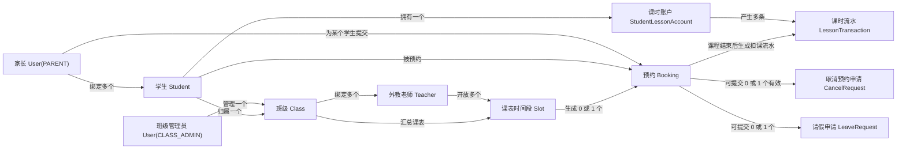

# 外教一对一英语课排课平台架构设计

## 1. 项目背景

本项目面向一个家长自发组织的外教一对一英语课 QQ 群。当前规模约为 1000 名学生、100 名外教老师。平台目标是提供老师信息展示、搜索筛选、预约排课和班级课表管理能力，减少群内人工沟通和排课管理成本。

第一版以最小可用产品为目标，优先解决“老师可查、课程可约、班级管理员可排课”的核心流程。

## 2. 技术架构

第一版采用轻量化单体 Web 应用：

```text
Next.js + Prisma + SQLite + 阿里轻量云服务器 + Nginx
```

- `Next.js`：同时承载登录页面、老师列表、老师详情页和管理后台。
- `Prisma`：作为数据库访问层，减少手写 SQL。
- `SQLite`：适合第一版单机部署，免独立数据库服务，维护成本低。
- `Nginx`：负责域名访问、HTTPS 和反向代理。
- 阿里轻量云服务器：承载应用、SQLite 数据文件和备份脚本。

SQLite 数据库文件建议放在稳定目录，例如：

```text
/var/www/english-class/data/app.db
```

老师音频第一版不上传到本地服务器保存，而是由班级管理员在后台填写喜马拉雅等外部音频页面链接。数据库中只保存外部音频访问 URL，不保存音频二进制内容。

MVP 阶段老师详情页不做站内嵌入播放器，只提供“收听自我介绍”“收试听课音频”等跳转按钮，在新窗口打开对应的喜马拉雅音频页面。后续如需要站内嵌入播放，再单独评估喜马拉雅开放平台接入、播放器 SDK、签名接口和播放失败兜底。

数据库文件不要放在部署时会被覆盖的代码目录中。上线后应开启 WAL 模式，并做每日数据库文件备份。

## 3. 用户角色与权限

平台包含三类用户：

### 总管理员

- 创建和管理用户账号。
- 审批家长自助注册申请，决定账号启用或拒绝。
- 创建班级，绑定老师和班级管理员。
- 查看和管理所有老师、班级、课表和预约。
- 处理全局数据维护和异常情况。

### 班级管理员

班级管理员由家长班长担任。一个班级管理员只管理一个班级，一个班级只绑定一个主要负责的班级管理员。

- 管理自己负责的班级。
- 编辑本班级下多个老师的资料，包括自我介绍音频和试课音频的外部链接。
- 维护班级课表中的可约时间段。
- 审核本班级预约申请。
- 审核本班级取消预约申请。
- 为本班级指定学生充值课时，查看课时余额和课时流水。
- 审核本班级学生的课前请假申请。

### 家长

- 登录后查看老师信息。
- 登录后提交预约申请。
- 查看自己的预约记录。
- 取消待审核预约；对已确认且尚未开始的预约提交取消申请，等待班级管理员审核。
- 查看自己名下学生的课时余额和课时流水。
- 对已确认且尚未开始的课程提交请假申请。

## 4. 核心业务关系

修正后的班级模型如下：

```text
Class
  -> Teacher[]
  -> ClassAdmin(User)
  -> Student[]
        -> primaryTeacher(Teacher)?
        -> StudentLessonAccount
              -> LessonTransaction[]
  -> Slot[] (per Teacher)
        -> Booking?
              -> CancelRequest?
              -> LeaveRequest?
```

关键规则：

- 一个外教老师只绑定一个班级。
- 一个班级可以绑定多个外教老师。
- 一个班级只有一个主要负责的班级管理员。
- 一个班级管理员只管理一个班级。
- 一个班级下可以有多个学生和家长。
- 一个家长账号可以绑定多个学生。
- 家长提交预约时必须选择一个学生。
- 同一家长的不同学生可以在同一班级，也可以在不同班级。
- `Student.primaryTeacherId` 为空时表示该学生尚未确定主老师；第一次预约审核通过后，将该预约对应老师写入 `primaryTeacherId`。
- `Student.primaryTeacherId` 已存在时，家长后续只能预约该老师的时间段加课。
- 当该学生不再存在 `PENDING` 或 `APPROVED` 的有效预约时，系统将 `Student.primaryTeacherId` 清空，学生回到未选老师状态，可重新选择老师。
- `Slot.teacherId` 必填，且该老师必须属于 `Slot.classId` 对应班级。
- `Booking.studentId` 必填，且 `Booking.parentUserId` 必须与该学生的 `parentUserId` 一致。
- 每个学生有一个课时账户，用于记录当前剩余课时。
- 班级管理员可以为自己班级内的指定学生充值课时。
- 课时充值、自动扣课、人工调整和返还都必须形成课时流水。
- 预约通过后不立即扣课，课程结束时间到达后由系统自动扣减课时。
- 已确认且尚未开始的预约可以由家长提交取消申请；班级管理员批准后，预约取消、时间段恢复开放，且该预约不扣课时。
- 家长只能在课程开始前提交请假申请，课程开始后不能补请假。
- 课前提交的请假如果被班级管理员批准，该节课不扣课时。
- 请假批准后不自动重新开放该时间段，只在预约上标记学生请假和课时免扣。
- 班级管理员只能管理自己负责班级的数据。
- 家长只能查看和操作自己的预约。

数据链路图：



## 5. 主要页面设计

### 访问入口

- 未登录用户只能访问登录和注册页面，不能进入老师列表和老师详情页。
- `/teachers`：登录后可访问的老师列表，支持按姓名、国家、价格、擅长年龄段、是否有可约时间筛选。
- `/teachers/[id]`：登录后可访问的老师详情页，展示简介、自我介绍音频、试课音频、专业学历、适合教授范围、班级信息和可约时间。
- 预约入口：家长登录后在老师详情页选择可约时间段并提交预约申请。

### 家长端

- 我的预约：展示待审核、已确认、已拒绝、已取消状态。
- 我的预约中对已确认且尚未开始的课程提供取消申请入口。
- 我的预约中对已确认且尚未开始的课程提供请假入口。
- 课时余额：按学生展示剩余课时、充值记录、扣课记录和请假免扣记录。

### 管理后台

- 总管理员后台：用户管理、注册审批、班级管理、老师管理和全局预约管理。
- 班级管理员后台：班级详情、老师列表、老师资料维护、音频链接维护、班级课表、预约审核、取消预约审核、课时管理和请假审核。
- 老师资料维护页：班级管理员可编辑老师姓名、国家、时区、简介、专业学历、适合教授范围、价格、擅长方向，并填写或替换自我介绍音频和试课音频的喜马拉雅外部链接。
- 课时管理页：按学生展示剩余课时、最近课时流水，并支持给指定学生充值。
- 请假审核页：集中展示本班级待审核请假申请，并支持批准或拒绝。
- 取消预约审核页：集中展示本班级待审核取消申请，并支持批准或拒绝。

音频链接与播放：

- MVP 不在本地服务器保存老师音频文件，也不提供音频文件上传能力。
- 班级管理员在后台填写自我介绍音频和试课音频的喜马拉雅页面链接。
- 后台保存时校验链接格式，优先只允许 `https://www.ximalaya.com/`、`https://m.ximalaya.com/` 等可信喜马拉雅域名。
- 链接保存后写入 `Teacher.introAudioUrl` 或 `Teacher.trialAudioUrl`。
- 老师详情页不做站内嵌入播放，展示“收听自我介绍”“收试听课音频”等按钮，点击后在新窗口打开对应的喜马拉雅页面。
- 如果老师未配置对应音频链接，详情页不展示该音频按钮。
- 后续如果需要站内嵌入播放，应优先设计为独立增强功能，评估喜马拉雅开放平台账号、声音 ID、播放器 SDK、服务端签名接口、浏览器自动播放限制和跳转播放兜底。

## 6. 课表与时间段设计

界面上采用“班级课表”方式维护，数据库中保留独立 `Slot` 表。

这样设计的原因是：`Class` 表保存班级长期信息，`Teacher` 表保存老师归属，而课表时间段是动态数据。一个班级下可能有多个老师，每个老师每周又可能有多个可约、待审、已约和取消的时间段。如果将课表塞入 `Class` 表中的 JSON 字段，后续查询、审核、防重复预约和历史追踪都会变复杂。

后台课表操作：

- 班级管理员进入自己负责的班级课表，并按老师查看或维护时间段。
- 点击空白时间：新增可约时间段。
- 点击可约时间：编辑、关闭或删除。
- 点击待审核时间：批准或拒绝预约。
- 点击已占用时间：查看学生、家长、备注和取消记录。

时间段状态：

- `OPEN`：可预约。
- `HELD`：已有预约申请，待审核。
- `BOOKED`：已确认占用。
- `CLOSED`：该老师在这个时间段不开放授课。

## 7. 课时管理与请假联动设计

### 课时账户

平台为每个学生维护一个课时账户。课时账户只保存当前余额，所有余额变化都通过课时流水追踪。

班级管理员可以在本班级学生详情或课时管理页为指定学生充值课时。充值成功后，系统更新学生课时账户余额，并写入一条 `LessonTransaction(RECHARGE)` 流水，记录充值数量、充值后余额、操作者和备注。

第一版默认一节课扣 1 课时，后续如果出现不同课程时长或不同扣课规则，可以通过 `Booking.lessonCost` 扩展。

### 自动扣课

预约审批通过后，系统只占用课表时间段，不立即扣课。课程结束时间到达后，自动任务扫描满足以下条件的预约：

- `Booking.status = APPROVED`
- 对应 `Slot.endAt <= now`
- 尚未完成课时扣减或免扣判断

自动任务按以下规则处理：

- 如果没有有效请假申请，则扣减 `Booking.lessonCost`，写入 `LessonTransaction(AUTO_DEDUCT)`，并将预约标记为已扣课。
- 如果存在已批准请假，则不扣课时，将预约标记为请假免扣。
- 如果存在课前提交但仍待审核的请假，则暂不扣课，将预约标记为等待请假审核。
- 如果请假被拒绝，课程已结束后自动任务会在后续执行中扣课。
- 如果学生课时余额不足，系统不允许自动扣成负数，而是将预约标记为余额不足，交由班级管理员处理。

自动扣课任务必须具备幂等性。同一个预约只能生成一次有效的自动扣课流水，避免重复扣课。

MVP 阶段可以使用服务器 `crontab` 每 5 到 10 分钟执行一次独立 Node 脚本，或调用受保护的 Next.js API route。任务执行结果和异常情况应写入 `AuditLog`。

### 取消预约联动

家长可以取消自己名下学生的 `PENDING` 预约。由于预约尚未确认，取消后直接将 `Booking.status` 改为 `CANCELLED`，并将对应 `Slot.status` 从 `HELD` 恢复为 `OPEN`。

家长也可以对自己名下学生的已确认预约提交取消申请，前提是当前时间早于课程开始时间，且同一预约不存在另一个有效的取消申请。课程开始后，前端不展示取消入口，后端也拒绝创建取消申请。

班级管理员只能审核自己班级内学生的取消申请。取消申请批准后：

- `CancelRequest.status = APPROVED`
- `Booking.status = CANCELLED`
- `Booking.lessonDeductionStatus = WAIVED_BY_CANCEL`
- 不产生扣课流水
- `Slot.status` 恢复为 `OPEN`
- 如果该学生已无 `PENDING` 或 `APPROVED` 的有效预约，则清空 `Student.primaryTeacherId`

取消申请拒绝后：

- `CancelRequest.status = REJECTED`
- `Booking.status` 保持 `APPROVED`
- `Slot.status` 保持 `BOOKED`
- 课程结束后正常自动扣课

已经开始、已经结束或已经扣课的预约默认不能再通过取消申请撤销扣课。如确有异常，由总管理员或具备权限的管理员通过人工调整流水处理，不直接修改历史流水。

### 请假联动

家长只能对自己名下学生的已确认预约提交请假，并且必须在课程开始前提交。课程开始后，前端不展示请假入口，后端也拒绝创建请假申请。

一个预约同时最多只有一个有效请假申请。家长可以在课程开始前取消待审核请假，课程开始后不可取消。

班级管理员只能审核自己班级内学生的请假申请。

请假批准后：

- `LeaveRequest.status = APPROVED`
- `Booking.lessonDeductionStatus = WAIVED_BY_LEAVE`
- 不产生扣课流水
- `Slot.status` 保持 `BOOKED`
- 时间段不自动重新开放，只在预约上标记学生请假

请假拒绝后：

- `LeaveRequest.status = REJECTED`
- 如果课程还未结束，等待课程结束后正常自动扣课
- 如果课程已经结束，自动任务在后续执行中扣课

已经扣课的预约默认不能再通过请假撤销扣课。如确有异常，由总管理员或具备权限的管理员通过人工调整流水处理，不直接修改历史流水。

## 8. 数据模型草案

### User

登录账号。

字段示例：`id`, `name`, `username`, `passwordHash`, `role`, `status`, `createdAt`, `updatedAt`

角色：`SUPER_ADMIN`, `CLASS_ADMIN`, `PARENT`

账号状态：`PENDING`, `ACTIVE`, `REJECTED`, `DISABLED`

规则：家长可以自助提交注册申请，初始状态为 `PENDING`；只有 `ACTIVE` 账号可以登录。超级管理员可以审批注册申请，也可以手动创建、禁用或重新启用账号。

### Class

班级。

字段示例：`id`, `name`, `classAdminId`, `description`, `status`

### Teacher

外教老师信息。

字段示例：`id`, `classId`, `name`, `country`, `timezone`, `bio`, `introAudioUrl`, `trialAudioUrl`, `education`, `suitableFor`, `price`, `specialties`

### Student

学生信息。

字段示例：`id`, `name`, `age`, `parentUserId`, `classId`, `primaryTeacherId`, `notes`

规则：`primaryTeacherId` 为空时，该学生可以首次选择本班级内任一可约老师；首次预约审核通过后写入该老师。后续家长新增预约时，目标老师必须等于 `primaryTeacherId`。当学生全部有效预约都被取消，不再存在 `PENDING` 或 `APPROVED` 预约时，系统清空 `primaryTeacherId`，允许重新选老师。

### StudentLessonAccount

学生课时账户。

字段示例：`id`, `studentId`, `balance`, `status`, `createdAt`, `updatedAt`

规则：一个学生只能有一个有效课时账户，自动扣课不能使 `balance` 小于 0。

### LessonTransaction

课时流水。

字段示例：`id`, `studentId`, `bookingId`, `type`, `amount`, `balanceAfter`, `reason`, `actorUserId`, `createdAt`

类型：`RECHARGE`, `AUTO_DEDUCT`, `MANUAL_ADJUST`, `REFUND`

### Slot

班级可约时间段。

字段示例：`id`, `classId`, `teacherId`, `startAt`, `endAt`, `status`

状态：`OPEN`, `HELD`, `BOOKED`, `CLOSED`

### Booking

预约申请。

字段示例：`id`, `slotId`, `parentUserId`, `studentId`, `status`, `message`, `lessonCost`, `lessonDeductedAt`, `lessonDeductionStatus`, `lessonDeductionReason`, `createdAt`

状态：`PENDING`, `APPROVED`, `REJECTED`, `CANCELLED`

课时扣减状态：`NOT_DUE`, `PENDING_LEAVE_REVIEW`, `DEDUCTED`, `WAIVED_BY_LEAVE`, `WAIVED_BY_CANCEL`, `FAILED_INSUFFICIENT_BALANCE`

### CancelRequest

取消预约申请。

字段示例：`id`, `bookingId`, `studentId`, `parentUserId`, `status`, `reason`, `submittedAt`, `reviewedAt`, `reviewerUserId`, `reviewNote`

状态：`PENDING`, `APPROVED`, `REJECTED`, `CANCELLED`

规则：取消申请只能在对应 `Slot.startAt` 前提交。班级管理员批准后，预约取消、时间段恢复 `OPEN`，该预约不扣课时；拒绝后，预约和时间段保持已确认占用状态。

### LeaveRequest

请假申请。

字段示例：`id`, `bookingId`, `studentId`, `parentUserId`, `status`, `reason`, `submittedAt`, `reviewedAt`, `reviewerUserId`

状态：`PENDING`, `APPROVED`, `REJECTED`, `CANCELLED`

规则：请假必须在对应 `Slot.startAt` 前提交，课程开始后不允许补请假。

### AuditLog

操作记录。

字段示例：`id`, `actorUserId`, `action`, `targetType`, `targetId`, `createdAt`

## 9. 第一版功能范围

第一版包含：

- 登录后查看老师展示与搜索筛选。
- 老师详情页。
- 账号密码登录。
- 家长自助注册，超级管理员审批注册申请。
- 管理员手动创建、禁用和启用账号。
- 家长提交预约申请。
- 班级管理员通过班级管理后台编辑老师信息并维护老师音频外部链接。
- 班级管理员维护班级课表。
- 班级管理员审核预约。
- 家长取消待审核预约；对已确认且尚未开始的预约提交取消申请。
- 班级管理员审核取消预约申请，批准后免扣课时并重新开放时间段。
- 学生全部有效预约取消后自动清空主老师，允许重新选择老师。
- 班级管理员给本班指定学生充值课时。
- 学生课时余额和课时流水查询。
- 课程结束后自动扣减学生课时。
- 家长在课程开始前提交请假申请。
- 班级管理员审核请假，请假批准后该节课免扣课时且时间段不自动开放。
- 总管理员维护用户、班级、老师和全局数据。

第一版暂不包含：

- 微信登录。
- 手机短信验证码。
- 在线支付。
- 自动排课算法。
- 家长评价与评价审核。
- 老师独立登录。
- QQ 群消息、短信或微信通知。
- 多语言界面。

## 10. 部署与运维建议

部署环境：

```text
阿里轻量云服务器
Nginx
Node.js
SQLite
PM2 或 systemd
```

### 服务器配置建议

MVP 阶段定义为小范围真实试运行，预计总用户约 200 人、同时在线约 20 人。该阶段优先验证老师展示、预约申请、课表维护、预约审核、课时扣减和请假审核等核心流程，暂不追求高并发和复杂运维。

MVP 阶段可以使用以下阿里云轻量应用服务器配置起步：

```text
CPU：2 核起，预算允许时优先 4 核
内存：4 GB 起，预算允许时优先 8 GB
系统盘：70 GB 起
公网带宽：200 Mbps 峰值带宽
操作系统：Alibaba Cloud Linux 3 或 Ubuntu LTS
部署组件：Nginx + Node.js + PM2/systemd + SQLite WAL
```

MVP 阶段继续使用 SQLite，前提是开启 WAL 模式、为关键写操作使用事务和唯一约束，并做好每日数据库文件备份。由于老师音频不在本地服务器保存和播放，MVP 阶段服务器容量风险主要不在公网音频带宽，而在预约、审核、请假、自动扣课等写操作集中发生时的 SQLite 写并发。

正式运行阶段不建议继续使用 SQLite。正式运行定义为面向完整用户群开放，或预计活跃用户明显超过 200 人、同时在线超过 20 人，或已经出现预约高峰期排队、数据库锁等待、接口响应变慢等现象。正式上线前应将数据库迁移到 MySQL；如果运维预算允许，优先使用阿里云 RDS MySQL 承担数据库服务。

### 正式数据库选择

正式上线后使用 MySQL 作为主数据库。MySQL 和 PostgreSQL 都能满足本项目的常规业务需求，并且 Prisma 都有良好支持；当前选择 MySQL，主要是因为国内部署和运维资料更常见，阿里云 RDS MySQL 使用经验更普遍，后续交接和维护成本更低。

| 对比项 | MySQL | PostgreSQL |
| --- | --- | --- |
| 团队熟悉度 | 国内团队更常见，资料和运维经验多 | 需要团队熟悉 PostgreSQL 的约束、索引和运维习惯 |
| 预约和课时一致性 | 能满足事务和唯一约束需求 | 事务、约束、并发控制和复杂查询能力更强 |
| 时间、课表和报表扩展 | 常规查询没有问题 | 对时间、聚合、统计、JSON 和复杂条件查询更友好 |
| Prisma 适配 | 支持成熟 | 支持成熟，类型和迁移体验也很好 |
| 运维和交接 | 阿里云 RDS MySQL 常见，团队接手成本低 | 能力强，但对团队数据库经验要求更高 |

本项目正式上线默认选择 MySQL。排课、预约、课时流水和请假审核需要事务、唯一约束和清晰的数据一致性边界，MySQL 可以满足这些核心要求。设计时应避免依赖 SQLite 特有行为，并通过 Prisma migration、数据库唯一约束和事务来保证后续迁移顺利。

PostgreSQL 可作为后续高级数据分析、复杂报表或团队能力变化后的备选方案，但不作为当前正式上线的默认数据库。

建议：

- 使用 Nginx 做 HTTPS 和反向代理。
- 使用 PM2 或 systemd 保持 Next.js 应用运行。
- SQLite 数据库文件放在独立持久目录。
- 每日自动备份 SQLite 数据库文件。
- 使用 `crontab` 或 systemd timer 定时执行自动扣课任务。
- 自动扣课任务需要记录执行结果，便于排查漏扣、重复扣和余额不足问题。
- 管理员密码必须加密存储，不保存明文密码。
- 正式上线前将 SQLite 迁移到 MySQL，推荐优先使用阿里云 RDS MySQL。

## 11. 后续扩展方向

后续可根据实际使用情况逐步加入：

- 手机验证码或微信登录。
- 家长预约提醒。
- 课程完成记录。
- 课时统计和报表。
- 老师端登录维护可约时间。
- 老师音频站内嵌入播放。
- 支付和账单管理。
- 家长评价、评价审核、评价标签和老师推荐排序。
