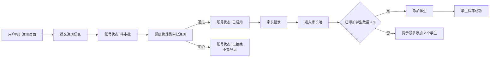
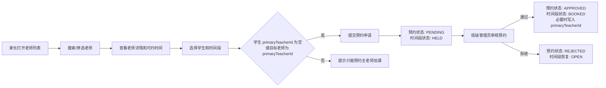
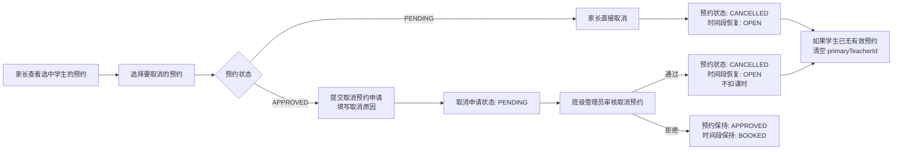
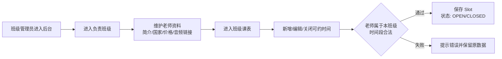
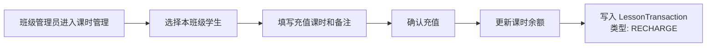
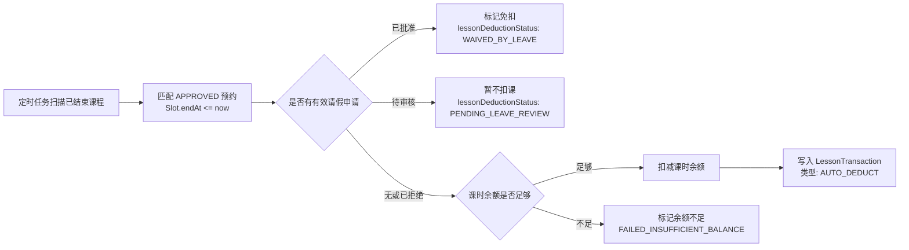
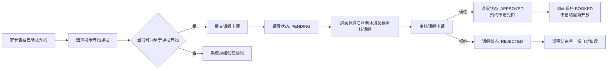

# 外教一对一英语课排课平台典型工作流

本文档基于 [架构设计](./english-class-scheduling-architecture.md) 梳理第一版的典型业务工作流。每个 workflow 独立成节，并用一条横向流程图表达。

## 1. 注册与登录

Precondition:

- 用户尚未拥有可登录账号，或已有账号但尚未登录。
- 超级管理员具备注册审批权限。
- 每个家长账号最多可以添加 2 个学生。

## 2. 家长查看老师并提交预约，班级管理员审核预约

Precondition:

- 家长已登录；未登录用户停留在登录界面，不能进入老师列表。
- 老师资料已创建，并至少存在一个 `OPEN` 的可约时间段。
- 家长账号已存在，且账号下至少绑定一个学生。
- 学生 `primaryTeacherId` 为空时表示新选老师；如果学生已有主老师，本次新增预约只能选择该老师加课。

## 3. 家长取消预约

Precondition:

- 家长已登录。
- 预约由当前家长提交，且预约状态为 `PENDING` 或 `APPROVED`。
- `PENDING` 预约尚未被班级管理员审核通过，可以由家长直接取消。
- `APPROVED` 预约已经确认占用时间段，且当前时间早于课程开始时间时，取消需要班级管理员审核。
- 同一预约不存在另一个有效的取消申请。

## 4. 班级管理员维护老师和可约时间

Precondition:

- 班级管理员已登录。
- 班级管理员已绑定且只能管理一个班级。
- 被维护的老师属于该班级。

## 5. 班级管理员充值课时

Precondition:

- 班级管理员已登录。
- 学生属于该班级管理员负责的班级。
- 学生已存在有效的课时账户。

## 6. 课程结束后自动扣课

Precondition:

- 预约状态为 `APPROVED`。
- 对应 `Slot.endAt <= now`。
- 该预约尚未完成扣课或免扣处理。
- 自动扣课任务具备幂等保护，同一预约不能重复扣课。

## 7. 家长课前请假，班级管理员审核请假

Precondition:

- 家长已登录。
- 预约属于当前家长名下学生。
- 预约状态为 `APPROVED`。
- 当前时间早于课程开始时间。
- 同一预约不存在另一个有效的请假申请。
- 班级管理员已登录，且请假申请对应学生属于该班级管理员负责的班级。

